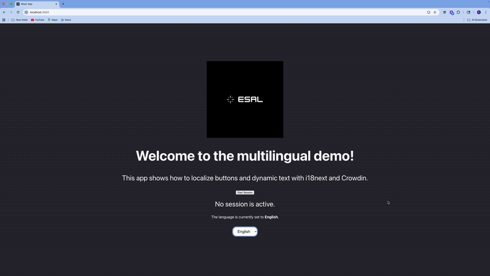
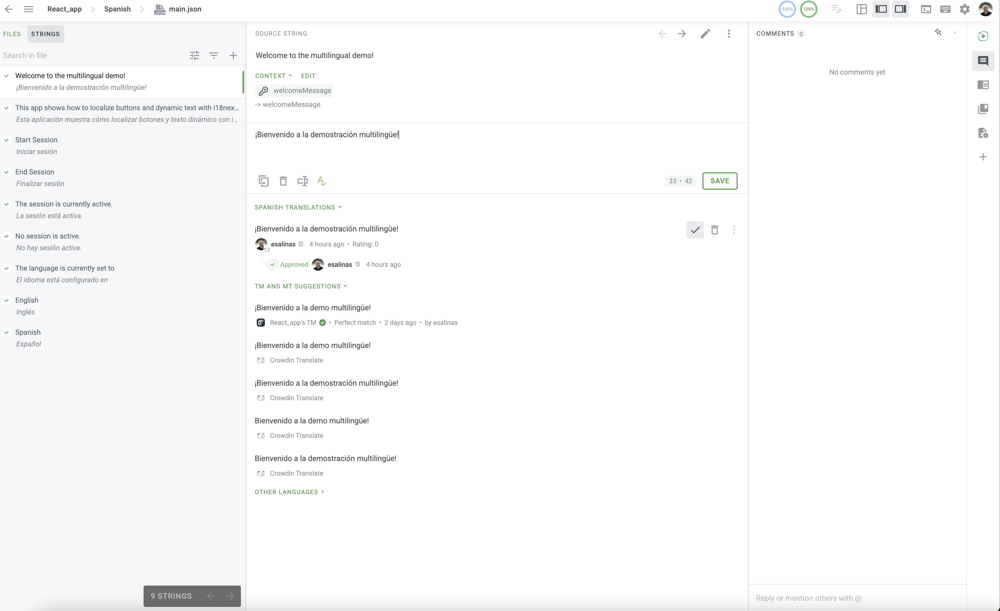
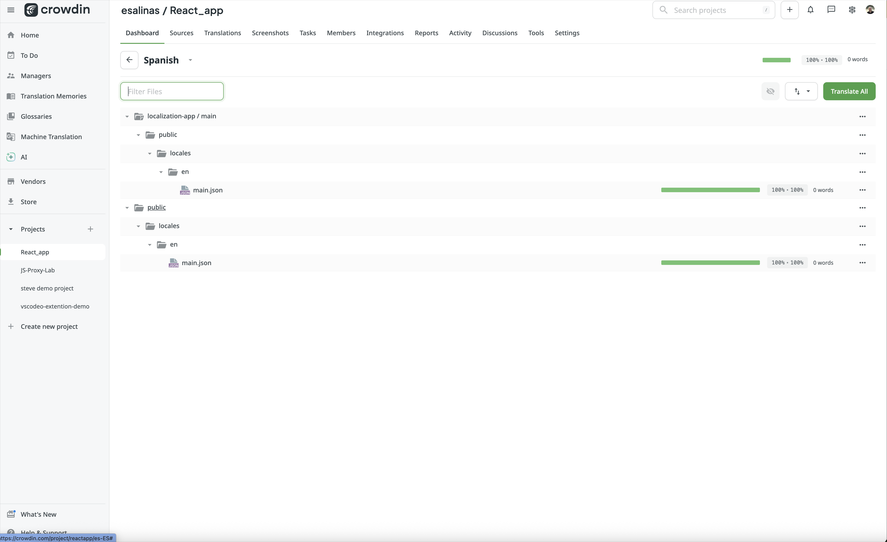
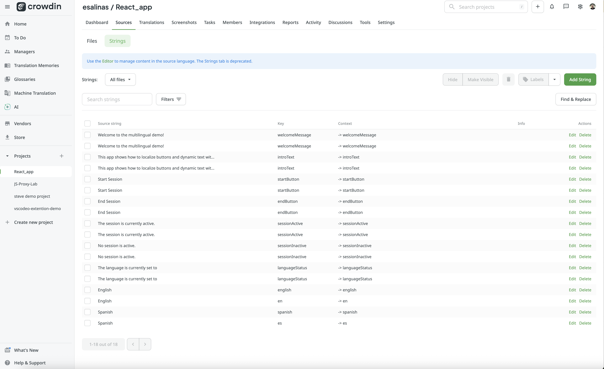

# Localization App Project

## Overview

This project demonstrates practical experience with modern localization workflows using Crowdin for translation management and continuous localization through automated integrations. Built as a React application using Create React App as the foundation, it showcases the complete localization pipeline from development to deployment.

## 🎬 Demo

Here’s a preview of the localized React application in action:


*The interface dynamically switches between English and Spanish using i18next and Crowdin-managed translation files.*

## Technologies Used

### Localization Stack
- **Crowdin** - Localization and translation management platform
- **i18next** - Internationalization framework
- **react-i18next** - React bindings for i18next
- **i18next-http-backend** - Dynamic translation file loading via HTTP

### Development Stack
- **React** - Frontend framework
- **Create React App** - React application bootstrapping tool
- **JavaScript/JSX** - Programming language with JSX syntax for component rendering
- **Visual Studio Code** - IDE for development
- **npm** - Package management
- **GitHub** - Version control and repository hosting

## Project Structure

```
localization-app/
├── public/
│   └── locales/
│       ├── en/
│       │   └── main.json           # Source English strings (source language)
│       └── es/                     # Spanish translations (approved translation from Crowdin)
│           └── main.json
├── src/
│   ├── App.js                      # Main application with i18n implementation
│   └── App.css
├── crowdin.yml                     # Crowdin configuration file
└── package.json
```

## Localization Workflow

### 1. Source File Management
- English source strings are maintained in `/public/locales/en/main.json`
- Translation keys follow consistent naming conventions
- JSON format ensures compatibility with translation tools

### 2. Continuous Localization Pipeline

```
Developer updates source → Push to GitHub → Crowdin auto-syncs → 
Translators work in Crowdin → Crowdin creates PR → Review & merge → 
Translations deployed
```

### 3. GitHub Integration
- **Automated sync**: Source files automatically sync from GitHub to Crowdin
- **Pull request workflow**: Completed translations return via automated PRs
- **Version control**: All translation updates are tracked in git history
- **Configuration**: `crowdin.yml` defines file patterns and translation paths

### 4. Translation Management
- Centralized translation interface for linguists
- Translation memory and terminology management
- Quality assurance checks
- Support for multiple target languages

## 🧩 Crowdin Interface Experience

This project included direct interaction with the Crowdin web interface for managing and proofreading translations. The goal was to gain hands-on experience with translation management systems (TMS), machine translation post-editing, and continuous localization workflows.

### Crowdin Screenshots

| Crowdin Section | Description |
|-----------------|--------------|
|  | Working in the Crowdin Translation Editor to review and edit Spanish translations. |
|  | Crowdin project dashboard showing translation progress and GitHub integration status. |
|  | Crowdin project sources. |

*These screenshots illustrate use of the Crowdin platform for translation management, post-editing, and synchronization with GitHub.*


## Key Features Demonstrated

### Internationalization Implementation
```jsx
// JSX syntax with embedded translation calls
<h1>{t("welcome")}!</h1>
<p>{t("message1")}</p>

// Dynamic language switching with event handlers
const onChange = (event) => {
  i18n.changeLanguage(event.target.value);
  setLanguage(language === "en" ? "Spanish" : "English");
}

// Translation keys embedded in JSX elements
<select name="language" onChange={onChange}>
  <option value="en">English</option>
  <option value="es">Spanish</option>
</select>
```

### Dynamic Translation Loading
Translations are loaded dynamically via HTTP from local JSON files using `i18next-http-backend`:

```javascript
i18n
  .use(HttpBackend)
  .use(initReactI18next)
  .init({
    fallbackLng: "en",
    backend: {
      loadPath: "/locales/{{lng}}/main.json"
    }
  });
```

**Benefits of this approach:**
- Smaller initial JavaScript bundle size
- Translations loaded only when needed (lazy loading)
- Translation updates possible without rebuilding the application
- Supports CDN delivery of translation files
- Seamless integration with Crowdin's automated PR workflow

### Configuration Management
```yaml
# crowdin.yml
files:
  - source: /public/locales/en/*.json
    translation: /public/locales/%two_letters_code%/%original_file_name%
```

### Language Detection & Fallbacks
- Fallback language configuration (English)
- Dynamic resource loading via HTTP backend
- Lazy loading of translation files (only loads languages when needed)
- Suspense handling for async translation loading
- Optimized bundle size by separating translations from application code

## Skills Demonstrated

### Localization & Translation Technology
- Translation file format handling (JSON)
- Translation memory and terminology management workflows
- CAT tool and TMS platform integration
- String externalization and key management
- Locale conventions and internationalization standards

### Technical Implementation
- Git/GitHub workflow and version control
- Configuration management (YAML, JSON)
- React component internationalization with JSX syntax
- JavaScript ES6+ (arrow functions, destructuring, hooks)
- Asynchronous resource loading via local JSON fetch
- Automated translation sync workflow via Crowdin and GitHub PRs

### Quality & Process
- Localized application testing and verification
- Translation context analysis
- UI/UX considerations across languages
- Workflow automation and optimization

## Contact

This project demonstrates practical localization experience with industry-standard tools and workflows.

**GitHub Repository**: [https://github.com/e-salinas/localization-app](https://github.com/e-salinas/localization-app)

## License

This project is licensed under the MIT License - see the [LICENSE](LICENSE) file for details.
